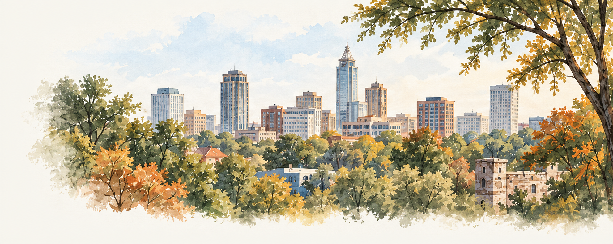

# Raleigh, together

## A five-day Raleigh plan with room to study, wander, and breathe.

[](https://nextjs.org/)
[](https://react.dev/)
[](https://www.typescriptlang.org/)

This is a static Next.js itinerary for a pediatric dental oral boards trip to Raleigh, October 2–6, 2026. It turns a pile of flight, hotel, exam, food, and study notes into a plan you can actually follow: morning study blocks, a map of places that fit the gap between them, exam-day logistics, and a print-friendly recap.



_The watercolor is an illustrative trip asset, not a documentary photograph or live map._

## What the site helps with

- **Five daily itineraries** cover flights, hotel, meals, local outings, study time, and exam-day logistics.
- **Explore Raleigh** groups places and October 2–6 events by area, with an interactive map and suggestions sized for a study break or free afternoon.
- **Study links** open the matching sessions, themes, flashcards, and recap on [Oral Boards](https://oral-boards.vercel.app/study). Old `/study` URLs permanently redirect there after the study app migration.
- **Print mode** turns the plan into a compact itinerary for a phone, paper folder, or hotel desk.

Try the flow: open the itinerary, pick Saturday’s study block, follow the nearby break suggestion, then use **Details** for the Monday exam logistics. The project keeps the trip humane by marking when to stop studying.

The repository is a public-safe snapshot. It omits personal names, reservation and ticket identifiers, payment details, and Gmail links. It has no authentication, mailbox access, airline integration, or live booking feed.

## Run locally

The app has no environment variables and uses the committed pnpm lockfile.

```bash
corepack enable
pnpm install --frozen-lockfile
npm install -g portless@0.15.7
pnpm dev
```

Open <https://raleigh-travel.localhost>. Use the exact URL printed at startup if you have customized the proxy.

### Named local URL with Portless

After the normal project setup, use [Portless](https://github.com/vercel-labs/portless/tree/v0.15.7)
to run this app alongside other repositories without choosing a port. Use Node.js
24 or newer, within this project's supported Node version, and install the CLI once:

```sh
npm install -g portless@0.15.7
pnpm dev
```

With default proxy settings, the primary checkout is available at
[https://raleigh-travel.localhost](https://raleigh-travel.localhost). Portless starts
Next.js on an available `PORT`. Linked Git worktrees get a branch
prefix; use the exact URL printed at startup. The proxy reuses its most recent
settings, so a custom port or domain can change that URL.

Run the first launch in an interactive terminal: the default HTTPS setup may ask
to trust a local certificate authority and request administrator access for port
443 and local hostname entries. Use `portless list` to see routes and
`portless doctor` for connection or certificate problems.

## Checks and build

```bash
pnpm format:check
pnpm test
pnpm check
pnpm build
```

`pnpm check` runs Oxfmt, strict type-aware Oxlint, TypeScript generation, and the offline Vitest suite. Packing-store tests cover browser storage failures, recovery, and cross-tab updates, with a React checkbox regression using mocked weather. `pnpm build` creates the production Next.js build. `pnpm format` writes the repository’s formatting when making source edits.

## Source map

| Path                       | Responsibility                                                    |
| -------------------------- | ----------------------------------------------------------------- |
| `src/lib/itinerary.ts`     | Five-day plan, schedule, study links, map links, and source URLs. |
| `src/lib/raleigh.ts`       | Places, areas, events, and “fits a study break” guidance.         |
| `src/lib/exam-day.ts`      | Candidate logistics used by the trip details page.                |
| `src/app/page.tsx`         | Main itinerary and day-by-day experience.                         |
| `src/app/raleigh/page.tsx` | Explore Raleigh page and map.                                     |
| `src/app/details/page.tsx` | Exam, travel, and practical details.                              |
| `src/components/`          | Timeline, map, print layout, navigation, and shared UI.           |
| `next.config.ts`           | Redirects legacy `/study/:path*` URLs to Oral Boards.             |

## Editorial limits

Sources were reviewed September 23, 2026. Monday registration is at 2:45 PM. The approximately 6:15–6:45 PM hotel return is an estimate; ABPD says to allow about four hours in total. Outings, meals, transfers, and study blocks are suggestions, not bookings. Hours, prices, events, and official candidate instructions can change, so confirm them before traveling; the latest ABPD candidate communication takes precedence.

The watercolor asset in `public/raleigh-watercolor.png` was created with the built-in image generation tool. Official ABPD, AAPD, and Vimeo material is linked rather than redistributed. Search-engine indexing is disabled; that setting is not authentication.
